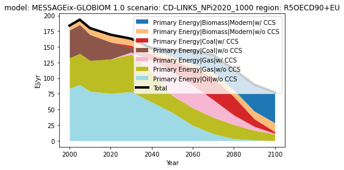

# AR6 Scenario Explorer Analysis-Demo

This project involves analyzing some salient aspects of the AR6 Scenario Explorer and creating a set of figures and tables to illustrate the findings using [`pyam`](https://pyam-iamc.readthedocs.io/en/stable/index.html). The analysis includes exploring emission trajectories and energy system configurations.

## Introduction
The [AR6 Scenario Explorer](https://data.ece.iiasa.ac.at/ar6/#/workspaces) provides a comprehensive database of scenarios for exploring the impacts of climate change on various aspects of the environment. In this project, we analyzed the data to gain insights into the emission trajectories and energy system configurations in the different scenarios.

## Installation

To install the required dependencies, please run the following command:

pip:

```pip install pyam```

conda/mamba:

```conda install -c conda-forge pyam```

## Database
To download the AR6 Scenario Explorer database, visit https://data.ece.iiasa.ac.at/ar6/#/downloads and download the desired files. For this project, we used the AR6_Scenarios_Database_R5_regions_v1.1 file.
`df = pyam.IamDataFrame(data='AR6_Scenarios_Database.csv'`

## Usage
The analysis was performed using pyam to extract relevant data and create visualizations. The Jupyter notebook containing the analysis and figures can be found in the notebooks directory.

The figures generated include:

   - Emission trajectories for different scenarios
   - Energy system configurations for different scenarios
   
   
Here's an example:

```py
import numpy as np
import matplotlib.pyplot as plt
import pyam
# import AR6 database
df = pyam.IamDataFrame(data='AR6_Scenarios_Database.csv')
# Filtering for model='MESSAGE*' 
df.filter(model='MESSAGE*').scenario
# Displaying
display_df = df.filter(model='MESSAGE*',scenario ='CD-LINKS_NPi2020_1000', variable='Primary Energy|*CCS', level='1-', region='R5OECD90+EU')
display_df.timeseries()
# Plotting
data = df.filter(model='MESSAGE*',scenario ='CD-LINKS_NPi2020_1000', variable='Primary Energy|*CCS', level='1-', region='R5OECD90+EU')

data.plot.stack(stack="variable", cmap="tab20", total=True)
plt.legend(loc=1)
plt.tight_layout()
plt.show()
```

## Contribution
Please feel free to cooperate and discuss!

## License
This project is licensed under the open source [MIT
License](https://github.com/PyPSA/PyPSA/blob/master/LICENSE.txt).
